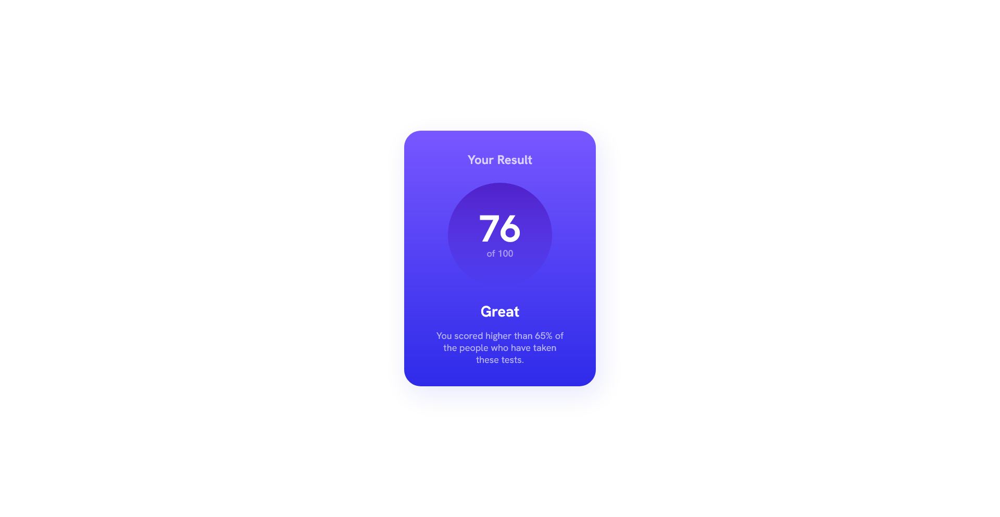
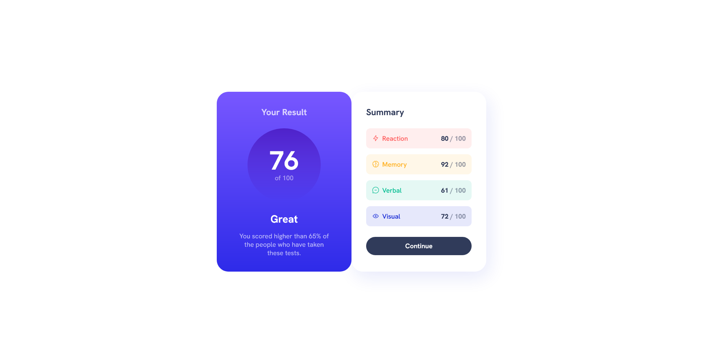
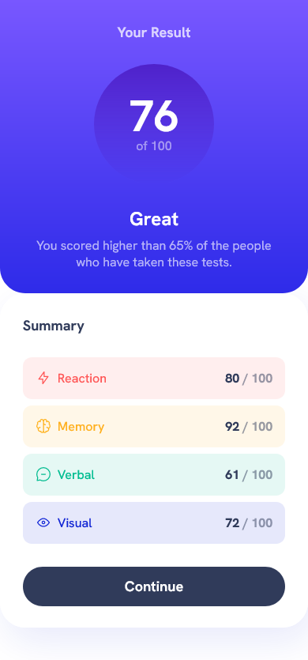

# Frontend Mentor - Results summary component solution

This is a solution to the [Results summary component challenge on Frontend Mentor](https://www.frontendmentor.io/challenges/results-summary-component-CE_K6s0maV). Frontend Mentor challenges help you improve your coding skills by building realistic projects.

## Table of contents

- [Overview](#overview)
  - [The challenge](#the-challenge)
  - [Screenshot](#screenshots)
  - [Links](#links)
- [My process](#my-process)
  - [Built with](#built-with)
  - [What I learned](#what-i-learned)
  - [Continued development](#continued-development)
- [Author](#author)

## Overview

### The challenge

Users should be able to:

- View the optimal layout for the interface depending on their device's screen size
- See hover and focus states for all interactive elements on the page
- See animation of element

### Screenshots






### Links

- Solution URL: [Github url](https://github.com/ankan-782/results-summary-component-with-animation)
- Live Site URL: [live link](https://results-summary-card-animation-rav.netlify.app/)

## My process

### Built with

- Semantic HTML5 markup
- Vanilla JS for interacting
- Vanilla CSS for styling
- CSS custom properties
- Flexbox
- CSS Grid
- Animation
- Mobile-first workflow

### What I learned

- Here I first time tried something interesting card sliding transition effect with translate property. Please look at the live site.

- And I also learned "another way" of how to include dynamic html element with the help of ```<template>``` html element. What To include dynamically with js, simply has to put inside it in the ```<template></template>``` markup. The ```<template></template>``` markup doesn't show on the browser.

example:

```html
<template data-summary-item-template>
    <div class="summary-item">
        <div class="flex-group">
            
            <h3 class="summary-item-title"></h3>
        </div>
        <p class="summary-item-score">
            <span></span> / 100
        </p>
    </div>
</template>
```

and js part example:

```js
// ...... more code .........
// fetch to retrieve data
data.forEach(element => {
    // cloning content from template
    const summaryItem = summaryItemTemplateEl.content.cloneNode(true).children[0];

    // selecting summary item's elements
    const summaryItemPictureEl = summaryItem.querySelector(".summary-item-picture");
    // ...... more code .........

    // adding things in summary item's elements
    summaryItemPictureEl.src = element.icon;
    // ...... more code .........

    // adding every summary item in the container
    summaryItemsContainerEl.append(summaryItem);
    // ...... more code .........
})
```

### Continued development

I want to brush up little more to animations. That would be the focusing area for my future projects. I am not completely comfortable with it.

## Author

- Website - [Avijit Roy](https://avijit-roy-portfolio.netlify.app/)
- Frontend Mentor - [@ankan-782](https://www.frontendmentor.io/profile/ankan-782)
- Twitter - [@AvijitAnkan](https://twitter.com/AvijitAnkan)
